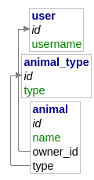

# Proof Of Concept - Tests Unitaires API

## Sommaire

 - ### [Jest](#jest)
 - ### [Supertest](#supertest)
 - ### [POC](#poc)
 - ### [Tests](#tests)

## Jest

Jest est un framework de test JavaScript permettant de créer des suites de tests. 
Il peut être utilisé pour tester des applications Vanilla mais il est aussi capable de tester des applications utilisants des frameworks comme React, Vue.js, Angular, ... en utilisant des librairies.

Pour installer Jest on peut utiliser la commande :

```bash
npm install --save-dev jest
```

L'argument `--save-dev` permet de préciser que le package ne doit être installé que dans le cadre d'un environnement de développement et non en production.

Pour rendre plus facile l'execution des tests on ajoute le script suivant dans le fichier `package.json` :

```json
"test": "jest"
```

Ce script sera executé en exécutant la commande `npm run test` ou `npm test` dans le terminal.
Le script cherchera par défaut un dossier `/tests/` pour trouver les fichiers de test qui doivent être du format `*.test.js`.

On peut ajouter au script ou à l'exécution l'argument `--detectOpenHandles` afin d'être informé si un processus asynchrone empêche l'arrêt du programme de test.

Si on veut obtenir un rapport de coverage, on peut ajouter l'argument `--coverage` à l'exécution pour avoir l'indication dans le terminal à la fin des tests. On peut aussi préciser un chemin avec l'argument `--coverageDirectory` pour que Jest génère le rapport sous la forme d'une page html.

Pour créer une suite de test on utilise la fonction `describe(name, fn)` dans laquelle on va déclarer des tests avec la fonction `test(name, fn, timeout)` (on peut aussi utiliser l'alias `it`

Au sein d'un test on peut utiliser `expect` pour déclarer les résultats attendu couplé aux méthodes `toBe()`, `toEqual` ou d'autres ([cf la doc officielle](https://jestjs.io/docs/api)).
Dans le cas ou on attend un objet json d'un type spécifique sans pour autant être sûr de la valeur, on peut utiliser `expect.objectContaining()` et déclarer les champs et leur type attendu dans l'objet.

Par exemple :
```js
expect(obj).toEqual(expect.objectContaining({ id: expect.any(Number), username: expect.any(String) }))
```

## Supertest

Supertest est une bibliothèque JavaScript permettant de tester les API REST. La bibliothèque s'utilise de paire avec des framework de test comme Jest par exemple.

Pour installer la bibliothèque on utilise la commande suivante :
```bash
npm install --save-dev supertest
```

Comme pour Jest, on reserve le package à l'environnement de développement.

Pour inclure la librairie dans le fichier de test on utilise la ligne suivante :
```js
const request = require('supertest')
```

À partir de là, on peut utiliser l'API de supertest pour effectuer des requêtes à notre API REST.

On peut effectuer des requêtes de la manière suivante :
```js
const  response = await  request(app).get('/')
```

Ensuite, on peut utiliser la fonction `expect()` de Jest pour tester la valeur de retour de notre requête.

Exemple :
```js
expect(response.text).toEqual('Hello World !')
expect(response.statusCode).toBe(200)
```

## POC

Dans le cadre de ce POC, j'ai créé une base de données simple de 3 tables : 

- User
- Animal_type
- Animal 



La base de données est sur un serveur MySQL et j'ai aussi mis en place une instance de serveur adminer pour administrer la base de données. Ces 2 serveurs sont démarré et hebérgé en local via un `docker-compose`.

Pour démarrer les 2 serveurs il suffit d'éxecuter la commande suivante:
```bash
docker-compose up
```

Pour accéder aux données de la base de données ou créer des données dans la base j'ai mis en place une API REST en NodeJS via le framework Express et j'utilise l'ORM Sequelize pour gérer mes requêtes à la base sans faire de SQL brut.

J'ai créé quelques routes basique dans mon API afin de les tester avec Jest et Supertest.
 
Les routes de l'API:

### - `GET /users`
Route pour récupérer la liste des utilisateurs

Retour :
`200` :
```json
[
	{
		"id" : "int",
		"username": "string"
	},
	...
]
```
---

### - `GET /user/:id`
Route pour récupérer les données de l'utilisateur précisé

Retours :
`200` :
```json
{
	"id" : "int",
	"username": "string"
}
```

`204`:
```json
{
	"error": "User not found"
}
```

---


### - `GET /user/:id/animals`
Route pour récupérer la liste des animaux de l'utilisateur précisé

Retour :
`200` :
```json
[
	{
		"id" : "int",
		"name": "string",
		"owner_id": "int",
		"type": "int"
	},
	...
]
```

---


### - `POST /user`
Route pour créer un nouvel utilisateur

Body content :
```json
{
"username": "string"
}
```

Retours :
`201` :
```json
{
	"id" : "int",
	"username": "string"
}
```
---

### - `PUT /user/:id`
Route pour modifier les données d'un utilisateur

Body content :
```json
{
"username": "string"
}
```

Retour :
`200` :
```json
[1] // Nombre d'entrées de la base qui ont été affecté donc 1
```
---

### - `DELETE /user/:id`
Route pour supprimer un utilisateur

Retour :
`200` 

---

### - `GET /animal/types`
Route pour récupérer la liste de tous les types d'animaux

Retour:
`200` :
```json
[
	{
		"id": "int",
		"type": "string"
	},
	...
]
```
---

### - `GET /animals`
Route pour récupérer la liste de tous les animaux

Retour :
`200` :
```json
[
	{
		"id" : "int",
		"name": "string",
		"owner_id": "int",
		"type": "int"
	},
	...
]
```
---

### - `GET /animal/:id`
Route pour récupérer les données d'un animal précis

Retours :
`200` :
```json
{
	"id" : "int",
	"name": "string",
	"owner_id": "int",
	"type": "int"
}
```

`204`:
```json
{
	"error": "Animal not found"
}
```

### - `GET /animal/type/:id`
Route pour récupérer la liste de tous les animaux du type précisé

Retour :
`200` :
```json
[
	{
		"id" : "int",
		"name": "string",
		"owner_id": "int",
		"type": "int"
	},
	...
]
```
---

### - `POST /animal`
Route pour créer un nouvel animal

Body content :
```json
{
	"name": "string",
	"owner_id": "int",
	"type": "int"
}
```

Retours :
`201` :
```json
{
	"id" : "int",
	"name": "string",
	"owner_id": "int",
	"type": "int"
}
```

`400` :
```json
{
	"error" : "Type not found"
}
```

`400` :
```json
{
	"error" : "User not found"
}
```
---

### - `PUT /animal/:id`
Route pour modifier un animal

Body content :
```json
{
	"name": "string",
	"owner_id": "int", // Optionnel
	"type": "int" // Optionnel
}
```

Retours :
`200` :
```json
[1] // Nombre d'entrées de la base qui ont été affecté donc 1
```

`400` :
```json
{
	"error" : "Type not found"
}
```

`400` :
```json
{
	"error" : "User not found"
}
```
---

### - `DELETE /animal/:id`
Route pour supprimer un animal

Retour :
`200`


## Tests

Liste des tests implémentés, tous sont valide et représentent 100% de coverage
```
API test suite
    Generic tests
      - tests GET / endpoint
      - tests GET /unknown endpoint
    User tests
      - tests GET /users endpoint
      - tests GET /user/:id endpoint
      - tests GET /user/:id/animals endpoint
      - test POST /user endpoint
      - test PUT /user/:id endpoint
      - test DELETE /user/:id endpoint
    Animal tests
      - tests GET /animals endpoint
      - tests GET /animal/:id endpoint
      - tests GET /animal/types endpoint
      - tests GET /animal/type/:id endpoint
      - test POST /animal endpoint
      - test PUT /animal/:id endpoint
      - test DELETE /animal/:id endpoint
      - test POST /animal endpoint with wrong type
      - test POST /animal endpoint with wrong owner
      - test PUT /animal endpoint with wrong type
      - test PUT /animal endpoint with wrong owner
```
